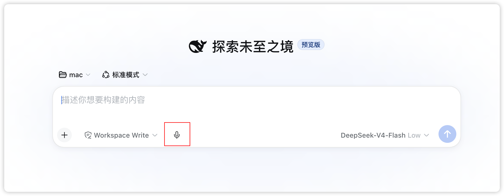

# dsh-voice-talk

Voice chat mode for DSH Web: tap the mic to enter a full-screen call, speak and listen as you go, and replies are read aloud as they stream. Bilingual UI, light/dark theme aware, with speech-rate and voice controls.

English | [中文](README.md)

[](https://www.npmjs.com/package/dsh-voice-talk)
[](./LICENSE)


## Quick start

### 1. Install

```sh
dsh plugin --profile web add dsh-voice-talk
dsh web   # restart after install
```

Install from source:

```sh
git clone https://github.com/duoduoqian708/dsh-voice-talk.git
cd dsh-voice-talk && npm install && npm run build
dsh plugin --profile web add /path/to/dsh-voice-talk
```

Requires the dsh web profile: 0.1.0-rc.7+ (both the 0.1.0-rc.x and 0.1.5-rc.x host lines are supported); Chrome / Edge, microphone permission and a network connection are also needed.

### 2. Configure a model

Get an API Key from [Alibaba Cloud Model Studio](https://bailian.console.aliyun.com/cn-beijing/model/settings/api-key), then paste it into Qwen's "Settings" under Settings → Plugins → Voice chat; the model and endpoint are built in. Qwen is the only engine for now; more will be added later.

### 3. Start talking

There is a mic icon next to the input box on the conversation page or workspace; tap it to enter the full-screen call and just start speaking. The red hang-up button or `Esc` exits; you can mute or collapse the panel mid-call.



## Settings

Changes on the settings page are persistent defaults; changes made in the call overlay apply to the current call only.

| Setting | Description | Default |
|---|---|---|
| Barge-in while speaking | Interrupt the readout by speaking; headphones recommended | Off |
| Auto-send after a pause (s) | How long a pause submits the utterance | 2 |
| Voice wave | Call-overlay waveform style: equalizer / ripple | Ripple |
| Rate | Readout speed, default per engine, adjustable per session | 1.0x |


## Highlights

- Follows the system theme: light / dark out of the box.
- Bilingual UI (Chinese / English): follows the platform language setting.
- Keys stay on your machine and are never uploaded: the browser never sees them, and speech requests are proxied by the host.
- Open source under MIT: auditable and self-hostable.

## Easter egg

Suppose you would rather not stare at a screen and feel like getting outdoors; suppose you happen to have a proxy port open — then take your phone out for a walk and talk through your development while strolling.


## Feedback

Found a bug or have an idea? Reach us either way:

- Open a [GitHub issue](https://github.com/duoduoqian708/dsh-voice-talk/issues) (preferred, easiest to track and fix)
- Comment on the plugin's card in the marketplace (shared with the plugin's discussion thread)

## License

[MIT](./LICENSE)
