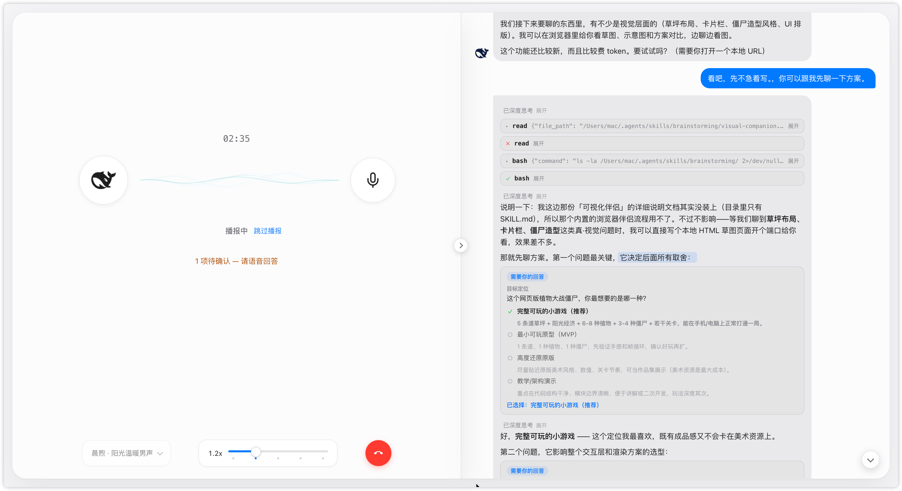
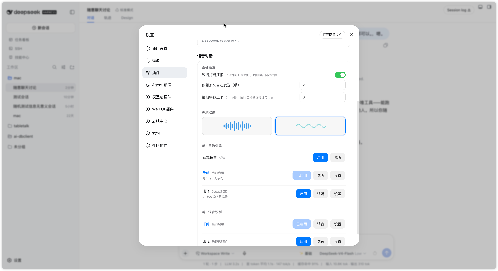
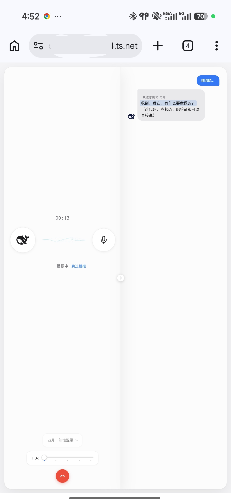

# dsh-voice-talk

DeepSeek Harness Web 的语音对话插件：点一下麦克风，全屏通话层起，边说边听，AI 回复边生成边念。

[](https://www.npmjs.com/package/dsh-voice-talk)
[](./LICENSE)



## 特性

- **一键通话**：对话页点麦克风即进入全屏通话层，红色挂机按钮或 `Esc` 退出。
- **边说边听**：AI 回复边生成边播报，只念正文（代码、推理、工具调用不念）；右侧信息流与原生一致，思考与工具调用完整展示。
- **逐句高亮**：播报进度在信息流里逐句高亮，听到哪读到哪。
- **通话中可静音、可收起**：静音不收录也不挂断，收起回到原生界面继续。
- **密钥不出本机**：云端引擎的密钥只保存在本机，浏览器全程接触不到。

## 快速开始

### 1. 安装

**方式一：npm（推荐）**

```sh
dsh plugin --profile web add dsh-voice-talk
```

装完重启：

```sh
dsh web
```

**方式二：源码（开发 / 使用未发布版本）**

```sh
git clone https://github.com/duoduoqian708/dsh-voice-talk.git
cd dsh-voice-talk
npm install && npm run build
dsh plugin --profile web add /path/to/dsh-voice-talk
```

- `npm run typecheck` 类型检查；`npm run build` 产出 `lib/index.js`（host 半边）与 `lib/client.js`（浏览器半边）。

### 2. 启用

设置 → 插件 → **语音对话** → 打开「说」「听」对应引擎的开关。

### 3. 配置语音（关键）

「说」可以用系统语音（免费离线）或千问、讯飞；「听」**只有云端引擎，没有离线识别**，必须配置对应密钥。最省事的方式：**申请一个阿里云百炼（DashScope）Key，同时填到「说」和「听」的千问引擎**，听说就都通了。

## 语音引擎

| 用途 | 引擎 | 费用 | 凭证 |
|---|---|---|---|
| 说 | 系统语音 | 免费 · 离线 | 无需 |
| 说 · 听 | **千问（主推）** | 约 1 元 / 万字符 | DashScope API Key |
| 说 · 听 | 讯飞 | 每日免费额度 | APPID + API Key + API Secret |

密钥入口：设置 → 插件 → 语音对话 → 对应引擎「设置」。填好后可点「试听 / 试音」验证。

## 配置项

设置页里改的是持久默认；通话层上调的是**会话级**，挂断保留、新会话回到默认。音色、语速在通话层也能临时调。

| 配置 | 说明 | 默认 |
|---|---|---|
| 说话打断播报 | 说话时打断正在播报的内容（建议戴耳机使用） | 关 |
| 停顿多久自动发送（秒） | 说完停顿多久自动提交 | 2 |
| 播报字数上限 | 单次播报的最大字数，0 为不限 | 0 |
| 声纹效果 | 通话层波形样式：律动 / 波纹 | 波纹 |
| 语速 | 播报语速，按引擎设默认，通话层可临时调 | 1.0x |
| 语言 | 识别与合成使用的语言 | zh-CN |



## 隐私与安全

云端引擎的密钥只保存在本机，浏览器接触不到，语音请求里也不会带上密钥。

## 常见问题

**点了麦克风没反应，或一直停在「聆听中」？**
确认「听」的引擎已配置密钥并启用（设置 → 插件 → 语音对话 → 听 · 语音识别）。

**有文字但没有声音？**
确认「说」的引擎已启用；云端引擎检查密钥与余额；系统语音检查系统音量与所选音色。

**说话打断不了播报？**
「说话打断播报」默认关闭，需手动打开；建议戴耳机，否则扬声器声音会被麦克风收录，影响打断判断。

## 彩蛋

假设你肩酸脖疼不想盯着屏幕，假设你恰好开了代理端口，假设你想运动工作两头兼顾——试着带着手机出门，边散步边聊开发吧。



## 环境要求

- dsh ≥ 0.1.0-rc.7，`web` profile
- Chrome / Edge
- 麦克风权限；云端识别需要网络

## License

[MIT](./LICENSE) · 问题反馈 [Issue](https://github.com/duoduoqian708/dsh-voice-talk/issues)
